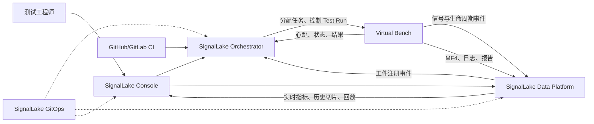
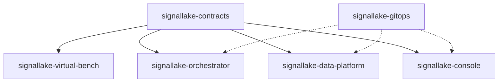
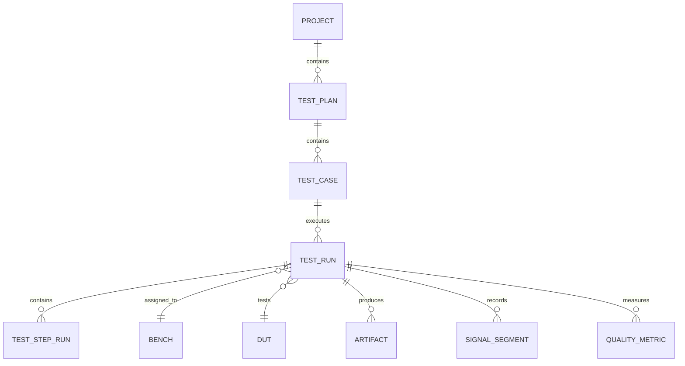
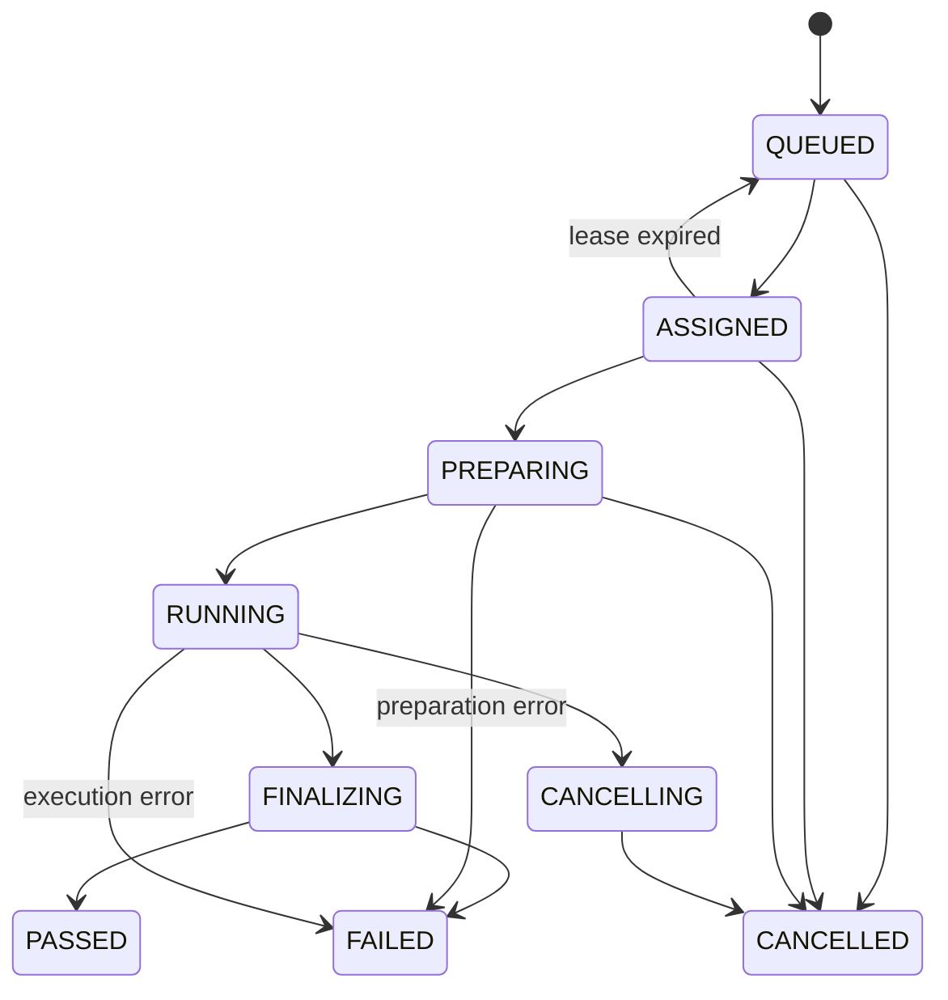
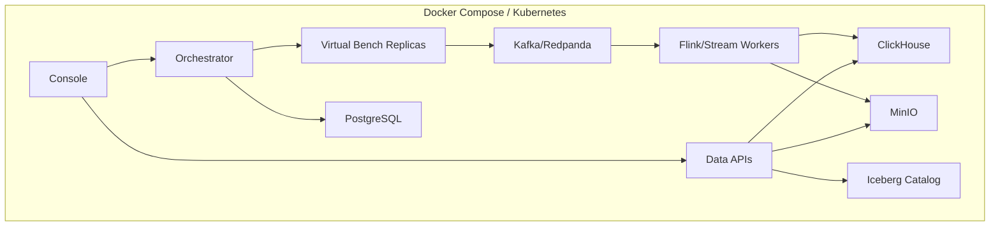

# SignalLake 核心架构

> Status: Target Architecture
>
> Version: 2.0
>
> Updated: 2026-07-02
>
> Scope: Simulation-First、HIL-Ready 的可测试参考实现

## 1. 项目定位

SignalLake 是一个以 HIL（Hardware-in-the-Loop）测试运行 `Test Run` 为核心的测试编排、数据采集、湖仓存储与可视化分析平台。

当前项目不会接入或拥有真实硬件。所有 ECU、DUT、总线、DAQ、台架状态和故障场景均由 Virtual Bench 模拟。系统通过明确接口保留未来接入真实硬件的扩展点，但当前不实现、验证或承诺任何真实厂商驱动、硬实时能力和硬件时间同步精度。

项目当前能够验证：

- HIL 测试任务的编排、状态机、取消、重试和追溯。
- Virtual Bench 与中央平台之间的控制协议和数据协议。
- 高频模拟信号的采集、缓冲、背压和断线恢复。
- 实时指标、PASS/FAIL、原始数据归档和 MF4 工件生成。
- 按 Test Run 查询、历史波形切片、降采样、Run 对比和 BEV 回放。
- 在明确模拟环境和负载模型下的吞吐量、延迟及故障恢复行为。

项目当前不能声称：

- 已兼容真实 CAN、PXI、DAQ、ECU 或 HIL 厂商设备。
- 已达到硬实时、确定性调度或零丢包要求。
- 已验证 PTP、硬件触发或多设备时钟同步精度。
- 模拟环境性能可以直接代表生产硬件环境性能。

## 2. 核心架构原则

### 2.1 Test Run 是聚合根

采集数据、测试步骤、台架、DUT、软件版本、配置、质量指标和工件都必须关联到唯一的 `test_run_id`。系统不接受缺少运行上下文的孤立数据进入正式归档路径。

### 2.2 控制面与数据面分离

- 控制面负责台架调度、命令、状态机和追溯。
- 数据面负责高频信号、流处理、文件和查询。
- Orchestrator 不承载高频信号。
- Data Platform 不负责测试任务调度。

### 2.3 采集与下游解耦

Virtual Bench 的采集生产者不能被网络、对象存储、MF4 封装或前端查询阻塞。采集、发布、流处理和文件封装通过缓冲区及持久化边界解耦。

### 2.4 热路径与冷路径分离

- ClickHouse 保存实时窗口指标和近期查询数据。
- S3/MinIO 保存 raw chunks、manifest、MF4 和其他不可变工件。
- Iceberg 保存 Test Run、文件、信号段和质量索引，并可承载派生 Parquet 数据。
- PostgreSQL 保存控制面事务状态，不保存高频时序信号。

### 2.5 契约优先

跨 Repo 协作只通过版本化的 Protobuf、OpenAPI、事件和工件引用完成。业务 Repo 不直接引用其他业务 Repo 的内部代码或数据库表。

### 2.6 模拟优先与确定性测试

所有核心流程必须能够使用固定随机种子、虚拟时钟和可重放场景在 CI 中复现。真实硬件适配是未来扩展，不是当前测试成立的前提。

### 2.7 机制通用、HIL 语义专用

缓冲、重试、对象存储、降采样等机制可以通用；Test Run、Bench、DUT、Test Step 和追溯模型保持 HIL 领域专用。

## 3. 系统上下文



系统存在两条不同但相互关联的主线：

```text
控制流：
CI/Console -> Orchestrator -> Virtual Bench -> Run/Step 状态 -> Orchestrator

数据流：
Virtual Bench -> Kafka -> Stream Processing -> ClickHouse/S3/Iceberg
              -> Query API -> Console
```

控制流和数据流通过 `test_run_id`、`test_step_id`、`artifact_id` 和版本化事件关联。

## 4. Repo 划分

SignalLake 由六个顶层 Repo 组成。

| Repo | 职责 | 主要技术 |
|---|---|---|
| `signallake-contracts` | Protobuf、OpenAPI、事件、Schema 和生成代码 | Protobuf、OpenAPI |
| `signallake-virtual-bench` | 虚拟台架、Mock 驱动、Bench Agent、DAQ、Test Runner | Python、pytest |
| `signallake-orchestrator` | 台架调度、Test Run、状态机、追溯和控制 API | FastAPI、PostgreSQL |
| `signallake-data-platform` | Kafka/Flink、ClickHouse、S3、Iceberg、MF4 和数据 API | Python/Java、Flink/Spark |
| `signallake-console` | 测试操作台、实时波形、回放、Run 对比和 BEV | React、TypeScript |
| `signallake-gitops` | Docker、Helm、Kubernetes、Argo CD 和环境配置 | Helm、Kubernetes |

### 4.1 `signallake-contracts`

拥有所有跨系统契约：

- `TestRunContext`
- Bench 注册、能力和心跳消息
- Test Run/Test Step 命令与生命周期事件
- Signal Block、Quality Metric 和 Artifact Reference
- Orchestrator OpenAPI
- Data Platform OpenAPI
- 生成的 Python、Java 和 TypeScript 类型

它不包含业务实现、数据库访问或部署配置。

### 4.2 `signallake-virtual-bench`

负责在无硬件条件下模拟完整 HIL 台架：

- Bench Agent 注册、心跳和命令执行。
- CAN/CAN FD、串口、TCP/UDP、DMM/DAQ 等 Mock 数据源。
- ECU/DUT 状态和故障注入。
- 测试步骤执行和 pytest 集成。
- Ring Buffer、批量发布和本地 spool。
- 固定随机种子的确定性场景。
- 延迟、丢包、乱序、重复、断线和超时注入。
- raw chunks、MF4、日志和测试报告生成。

未来真实硬件插件只能通过既有 HAL 接口接入，不允许改变上层 HIL 契约。

### 4.3 `signallake-orchestrator`

负责控制面：

- Test Plan、Test Case、Test Run 和 Test Step。
- Virtual Bench 注册、能力匹配、预约和租约。
- 任务队列、分配、取消、超时和重试。
- 软件版本、配置、DUT、Bench 和工件追溯。
- 面向 CI 和 Console 的控制 API。
- 消费运行及工件生命周期事件。

Orchestrator 使用 PostgreSQL 保存事务状态，但不保存信号采样点。

### 4.4 `signallake-data-platform`

负责数据面：

- 接收信号和生命周期事件。
- 计算实时窗口指标和 PASS/FAIL 输入。
- 写入 ClickHouse 热数据。
- 写入 S3/MinIO cold staging 和 manifest。
- 生成、校验和注册 MF4。
- 维护 Iceberg 文件、信号段和质量索引。
- 提供实时指标、历史切片、降采样和回放 API。
- 为 Spark/Trino/Python 提供离线分析出口。

### 4.5 `signallake-console`

负责用户交互：

- Bench 状态和任务队列。
- 创建、取消和查看 Test Run。
- 当前 Test Step 和实时 PASS/FAIL。
- 实时信号和质量指标。
- 历史波形、局部放大和多 Run 对比。
- 失败步骤、软件版本、配置和工件追溯。
- 2D BEV 和测试场景时间轴回放。

Console 只能访问 Orchestrator API 和 Data Platform API，不能直接访问数据库。

### 4.6 `signallake-gitops`

负责中央平台的声明式部署：

- Docker 镜像引用。
- Helm Chart 和环境 values。
- Kubernetes Namespace、Secret 引用和网络策略。
- Argo CD Application。
- 本地、CI 和共享开发环境配置。

Argo CD 负责部署平台，不负责调度 HIL Test Run。Test Run 调度只属于 Orchestrator。

## 5. Repo 依赖与所有权



依赖规则：

- `signallake-contracts` 不依赖任何业务 Repo。
- 业务 Repo 可以依赖生成的 contracts 包。
- 业务 Repo 之间禁止直接代码依赖。
- 每个有状态服务只拥有自己的数据库和迁移。
- 跨系统数据库查询被禁止。
- GitOps Repo 只引用版本化镜像和配置，不包含业务源码。

## 6. HIL 核心领域模型



核心标识：

```text
project_id
test_plan_id
test_case_id
test_run_id
test_step_id
bench_id
dut_id
artifact_id
device_id
channel_id
```

每个归档信号事件至少包含：

```text
event_id
test_run_id
test_step_id
bench_id
dut_id
device_id
channel_id
signal_name
source_timestamp
ingest_timestamp
simulation_timestamp
clock_domain
sample_rate
unit
payload_type
payload_encoding
schema_version
quality_flags
```

## 7. 状态机

### 7.1 Test Run



要求：

- 所有命令包含幂等键。
- 状态迁移通过乐观锁或版本号保护。
- Bench 分配使用有时限的租约。
- Agent 断线后由 Orchestrator 根据租约和最后确认状态恢复。
- 重试创建新的 execution attempt，不覆盖原失败记录。

### 7.2 Artifact

```text
STAGED -> PACKAGING -> UPLOADED -> VALIDATED -> REGISTERED
                         |
                         v
                       FAILED
```

只有 `REGISTERED` 工件可以被正式查询和引用。S3 对象与 Iceberg 索引必须通过 checksum 和 `artifact_id` 保持一致。

## 8. 通信与契约

| 场景 | 协议 | 说明 |
|---|---|---|
| CI/Console 控制 Orchestrator | REST/OpenAPI | 创建、取消、查询 Test Run |
| Orchestrator 控制 Bench Agent | gRPC | 低频命令、确认和状态 |
| Agent 心跳 | gRPC stream 或 WebSocket | 包含租约、能力和当前任务 |
| 高频信号 | Kafka + Protobuf | 与控制面隔离 |
| 生命周期事件 | Kafka + Protobuf | Run、Step、Artifact 事件 |
| 大文件 | S3/MinIO | raw chunks、MF4、日志、报告 |
| Console 实时更新 | WebSocket/SSE | 指标、状态和进度 |
| 历史查询 | REST | 按 Run、Signal 和时间范围切片 |

首批事件：

```text
BenchRegistered
BenchHeartbeat
TestRunCreated
TestRunAssigned
TestRunStarted
TestStepStarted
SignalBlockProduced
TestStepFinished
TestRunFinished
ArtifactUploaded
ArtifactRegistered
QualityMetricProduced
```

契约演进规则：

- 新字段必须向后兼容。
- Protobuf 字段编号不得复用。
- 破坏性变化必须发布新的 major version。
- 消费者必须能够忽略未知字段。
- 每个 Repo 的 CI 必须运行契约兼容测试。

## 9. 数据架构

### 9.1 热路径

```text
Virtual Bench
  -> Kafka signal topics
  -> Flink/stream worker
  -> 100 ms 或 1 s 窗口指标
  -> ClickHouse
  -> Dashboard API
  -> Console
```

热路径指标包括：

```text
mean
rms
min
max
p95
spike_count
missing_sample_count
out_of_range_count
pass_fail_status
quality_flag
```

### 9.2 冷路径

```text
Virtual Bench
  -> Kafka
  -> cold staging worker
  -> S3 raw chunks + manifest
  -> MDF4 Packager
  -> S3 final MF4
  -> Registrar
  -> Iceberg indexes
```

Virtual Bench 也可以模拟 Physical Logger，直接上传原生 MF4 到 landing 区，再由 Registrar 统一校验和注册。

### 9.3 存储职责

| 存储 | 数据 |
|---|---|
| PostgreSQL | Bench、Test Run、Step、租约、追溯和控制状态 |
| ClickHouse | 实时/近期窗口指标和状态 |
| S3/MinIO | raw chunks、manifest、MF4、日志、报告、导出数据 |
| Iceberg | Test Run、文件、信号段、质量索引和派生 Parquet |

建议对象路径：

```text
s3://signallake/staging/test_case_id={id}/run_id={id}/bench_id={id}/part-0001.bin
s3://signallake/staging/test_case_id={id}/run_id={id}/bench_id={id}/manifest.json
s3://signallake/final_mf4/test_case_id={id}/run_id={id}/segment-0001.mf4
s3://signallake/artifacts/test_case_id={id}/run_id={id}/reports/report.json
s3://signallake/exports/test_case_id={id}/run_id={id}/
```

Iceberg 最小索引：

```text
test_run_index
artifact_index
mdf4_file_index
signal_segment_index
quality_metric_index
```

## 10. 查询与可视化

历史信号查询流程：

```text
Console
  -> Slice API(test_run_id, signal_name, time range, max_points)
  -> Iceberg signal_segment_index
  -> 定位 S3/MF4 文件和 block offset
  -> HTTP Range Read 或缓存
  -> asammdf cut/filter
  -> min/max envelope + downsampled series + anomaly markers
  -> Console
```

不单独依赖 LTTB 保存波形特征，因为 LTTB 可能丢失短时尖峰。默认响应同时包含：

- min/max envelope
- 降采样序列
- 异常点 marker
- 原始数据来源和质量标记

前端推荐使用 React。普通大规模时序波形优先使用 uPlot/Canvas；只有明确证明收益的场景再使用 WebGL。BEV 使用 Canvas/WebGL，并通过时间轴按帧或按窗口请求数据。

## 11. Virtual Bench 与可测试性

### 11.1 模拟能力

每个模拟场景由版本化配置描述：

```text
scenario_id
scenario_version
random_seed
duration
signal_definitions
test_steps
fault_schedule
network_profile
expected_outcome
```

同一场景、版本和随机种子必须产生可重复的关键事件和预期结果。

### 11.2 测试分层

```text
单元测试
  HAL、状态机、缓冲、算法和数据转换

契约测试
  Protobuf、OpenAPI、事件兼容性和生成类型

组件测试
  每个服务与其拥有的存储

集成测试
  Virtual Bench + Orchestrator + Kafka + Data Platform

端到端测试
  创建 Run -> 分配 Bench -> 采集 -> 生成 MF4 -> 注册 -> 回放

性能测试
  模拟高频数据、背压、查询范围和并发 Run

故障测试
  丢包、乱序、重复、Agent 断线、服务重启和任务超时
```

性能结果必须记录测试环境、数据模型、采样率、并发数、消息大小和持续时间，禁止将模拟测试结果描述为真实 HIL 硬件性能。

### 11.3 必须具备的端到端验收

```text
1. CI 或 Console 创建 Test Run。
2. Orchestrator 分配一个 Virtual Bench。
3. Virtual Bench 执行多个 Test Step。
4. 信号持续写入 Kafka，断线时进入本地 spool。
5. 实时指标写入 ClickHouse 并推送到 Console。
6. cold staging 生成 raw chunks 和 manifest。
7. Packager 生成 MF4，Registrar 完成注册。
8. Orchestrator 关联最终工件并结束 Test Run。
9. Console 可以按失败步骤回放并对比历史 Run。
```

## 12. 部署架构

当前无硬件环境下：



环境分级：

```text
local:
  Docker Compose，单个或少量 Virtual Bench

ci:
  临时环境，运行契约、集成和 E2E 测试

shared-dev:
  Kubernetes，由 Argo CD 管理
```

未来真实 Bench Agent 通常应部署在接近硬件的主机进程或 systemd 服务中，而不是默认作为 Kubernetes Pod。该部署方式只有在获得真实硬件后才能验证。

## 13. 安全、可靠性与可观测性

最低要求：

- 所有命令和事件具有 `event_id`、`correlation_id` 和 `test_run_id`。
- 服务间身份认证和最小权限访问。
- Console 不持有数据库凭据。
- 对象上传使用 checksum，注册操作必须幂等。
- Kafka 消费者能够处理重复和乱序事件。
- 控制状态和数据工件分别备份。
- 日志、指标和 Trace 使用统一关联 ID。
- Secret 不进入 Git，GitOps 只保存 Secret 引用或加密内容。

关键观测指标：

```text
queued_run_count
bench_heartbeat_age
run_state_transition_latency
signal_ingest_rate
signal_drop_count
spool_backlog_bytes
kafka_consumer_lag
artifact_registration_latency
slice_query_latency
clock_drift_us_simulated
```

## 14. 实施路线

### Phase 0：Contracts 与本地底座

- 建立六个逻辑 Repo 的目录和边界。
- 定义 Test Run、Bench、Signal 和 Artifact 契约。
- 启动 PostgreSQL、Kafka/Redpanda、ClickHouse 和 MinIO。
- 建立跨 Repo 契约兼容测试。

### Phase 1：Virtual Bench

- 实现 Bench Agent 和固定随机种子的模拟场景。
- 实现 CAN/DMM/SAFETY 最小 Mock。
- 实现采集、Ring Buffer、Publisher 和本地 spool。
- 验证持续信号发布和断线恢复。

### Phase 2：Orchestrator

- 实现 Bench 注册、心跳、租约和任务分配。
- 实现 Test Run/Test Step 状态机。
- 提供 CI/Console 控制 API。
- 建立版本、DUT、Bench 和运行追溯。

### Phase 3：实时数据闭环

- 实现热路径流处理和 ClickHouse 表。
- 实现 Dashboard API 和实时推送。
- Console 展示 Bench、Run、Step、指标和 PASS/FAIL。

### Phase 4：MF4 与冷路径

- 实现 raw chunks、manifest、Packager 和 Registrar。
- 建立 S3 与 Iceberg 一致性状态机。
- 将工件注册结果关联回 Test Run。

### Phase 5：历史分析

- 实现 Slice API、envelope、降采样和异常点。
- 实现历史回放、多 Run 对比和失败步骤定位。
- 实现最小 2D BEV 回放。

### Phase 6：GitOps 与质量验证

- 建立 Helm 和 Argo CD 配置。
- 在 CI 中运行完整 E2E、性能和故障测试。
- 输出带环境说明的性能基线和已知限制。

## 15. 文档结构

本文件是顶层架构和唯一入口。详细设计后续拆分为：

```text
docs/architecture/
  01-system-context.md
  02-hil-domain-model.md
  03-virtual-bench-architecture.md
  04-orchestration-control-plane.md
  05-contracts-and-integration.md
  06-data-platform-and-storage.md
  07-api-and-frontend.md
  08-deployment-and-operations.md

docs/decisions/
  ADR-0001-repository-boundaries.md
  ADR-0002-virtual-bench-model.md
  ADR-0003-control-and-data-protocols.md
  ADR-0004-hot-and-cold-storage.md
  ADR-0005-mf4-lifecycle.md
```

专题文档是对应领域细节的唯一事实来源。本文件只保留跨系统边界、原则和摘要，避免出现两套相互冲突的设计。

## 16. 历史文档

旧版通用工业测试数据平台设计保存在 [`ARCHITECTURE_OLD.md`](./ARCHITECTURE_OLD.md)。

旧版文档中的 OT/IT 解耦、热冷路径、MDF4 Packager、Iceberg 索引和 Slice Service 等设计已被本架构继承；通用工业定位、单一 Monorepo 假设和缺少 HIL 控制面的部分不再作为当前目标架构。
