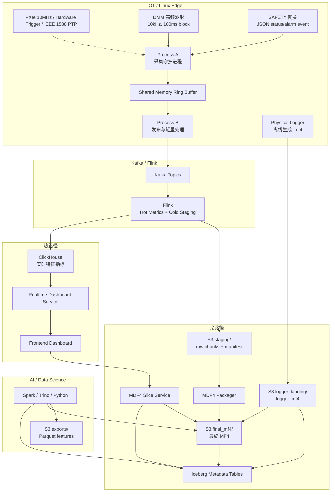

# SignalLake 工业测试数据平台架构与实施规划

## 1. 项目定位

SignalLake 面向工业测试、车载测试、产线传感器采集和高频波形分析场景，目标是在同一套平台中同时满足：

- OT 侧稳定采集：低抖动、低丢包、可追溯的原始数据采集。
- IT 侧统一治理：支持检索、归档、回放、质量追踪和 AI 分析。
- 前端测试大屏：支持近实时状态监控、PASS/FAIL 判断和历史波形局部放大。

核心架构原则：

- OT 与 IT 解耦：边缘采集进程不被网络、磁盘或下游系统阻塞。
- 热数据与冷数据分离：ClickHouse 存实时特征，S3/MinIO 存原始 MF4 和 raw chunks。
- 流处理与文件封装分离：Flink 负责实时计算与 staging，MDF4 Packager 负责最终 MF4 生成。
- 文件与索引一致：S3 文件注册到 Iceberg 时使用明确状态机，避免文件与元数据不一致。
- 前端不直连数据库：通过 Dashboard Service 和 Slice Service 提供受控 API。

## 2. 总体架构



## 3. 推荐项目结构

当前仓库建议采用 monorepo，先完成本地可运行 MVP，再逐步替换为生产级实现。

```text
SignalLake/
  ARCHITECTURE.md
  README.md
  docker-compose.yml
  .env.example

  docs/
    architecture/
      data-flow.md
      deployment.md
      api.md
      schema.md
    decisions/
      ADR-0001-storage-layout.md
      ADR-0002-edge-buffer.md

  proto/
    daq_event.proto
    quality_metric.proto
    manifest.proto

  infra/
    docker/
      kafka/
      flink/
      clickhouse/
      minio/
      iceberg/
    k8s/
      edge/
      services/
      jobs/
    sql/
      clickhouse/
      iceberg/

  edge/
    collector-a/
      README.md
      src/
      tests/
    publisher-b/
      README.md
      src/
      tests/
    simulator/
      dmm_simulator/
      safety_simulator/
      logger_simulator/

  stream/
    flink-jobs/
      hot-metrics-job/
      cold-staging-job/
    schemas/
    tests/

  services/
    dashboard-service/
      src/
      tests/
      Dockerfile
    slice-service/
      src/
      tests/
      Dockerfile
    packager-service/
      src/
      tests/
      Dockerfile
    registrar-service/
      src/
      tests/
      Dockerfile
    upload-agent/
      src/
      tests/
      Dockerfile

  frontend/
    dashboard/
      src/
      tests/
      Dockerfile

  libs/
    event-envelope/
    object-store/
    iceberg-client/
    quality-rules/
    mf4-utils/

  scripts/
    dev-up.sh
    dev-down.sh
    seed-demo-data.sh
    run-e2e.sh

  tests/
    integration/
    fixtures/
      mf4/
      events/
      manifests/
```

## 4. 模块边界

### 4.1 Edge Collector A

职责：

- 从 DMM、SAFETY 等硬件 buffer 读取数据。
- 绑定硬件时间戳或 PTP 时间戳。
- 写入本机共享内存 ring buffer。

明确不做：

- 不写磁盘。
- 不发网络请求。
- 不等待 Kafka ack。
- 不做复杂计算或大对象序列化。

MVP 阶段可用 Python/Go 模拟，生产阶段建议使用 C++、Rust 或高性能 Go 实现。

### 4.2 Edge Publisher B

职责：

- 从 ring buffer 异步消费数据。
- 标准化 event envelope。
- 使用 Protobuf 序列化。
- 批量发布到 Kafka。
- Kafka 异常时写 local NVMe spool，恢复后补发。

统一事件字段：

```text
event_id
test_id
run_id
device_id
source_type
channel_id
signal_name
timestamp_start
timestamp_end
sample_rate
unit
payload_type
payload_encoding
schema_version
quality_flags
encoding_content
```

### 4.3 Kafka

推荐 topic：

```text
daq_raw_event_topic
daq_safety_event_topic
daq_quality_metric_topic
```

MVP 可以先使用：

```text
daq_unified_stream
```

但消息中必须保留 `source_type`、`payload_type`、`schema_version`、`test_id`、`run_id`、`channel_id`，方便后续分流。

### 4.4 Flink

职责：

- 消费 Kafka。
- 对热路径计算 100ms 或 1s 窗口特征。
- 写入 ClickHouse。
- 对冷路径写 S3 staging raw chunk。
- 生成 manifest event。

不负责：

- 不在 Flink 内生成最终 `.mf4` 文件。
- 不承担大文件封装、复杂 channel 对齐和长期文件状态管理。

热路径特征：

```text
mean
rms
min
max
p95
spike_count
missing_sample_count
out_of_range_count
pass_fail_status
quality_flag
```

### 4.5 MDF4 Packager

职责：

- 读取 S3 staging raw chunks 和 manifest。
- 按 `test_id/run_id/device_id` 聚合。
- 按 event time 排序。
- 校验 missing chunk、out-of-order、checksum。
- 对齐 channel group。
- 调用 asammdf 或 MDF4 writer 生成最终 `.mf4`。
- 写入 `s3://.../final_mf4/`。
- 提取 header、channel、signal metadata。
- 提交 Iceberg 索引。

### 4.6 Logger Upload / Registrar

Physical Logger 不经过 Kafka。它离线生成原生 `.mf4`，联网后进入：

```text
s3://daq-bucket/logger_landing/
```

Registrar 职责：

- 校验文件完整性。
- 计算 checksum。
- 读取 MDF4 Header。
- 提取 channel metadata。
- 提取 start_time/end_time。
- 注册 Iceberg。
- 必要时移动到 `final_mf4/`。

### 4.7 Realtime Dashboard Service

职责：

- 从 ClickHouse 查询实时指标。
- 对前端提供 WebSocket / SSE。
- 做权限控制、租户隔离、查询缓存、连接管理、限流和降采样。

前端不直接访问 ClickHouse。

### 4.8 MDF4 Slice Service

职责：

- 接收前端历史框选请求。
- 查询 Iceberg `signal_segment_index`。
- 定位 `file_id/s3_path/channel_id/time range`。
- 优先用 `block_offset_hint + HTTP Range Request` 减少读取量。
- 在索引不足或压缩复杂时回退到服务端缓存或片段读取。
- 使用 asammdf 执行 cut/filter/channel extraction。
- 返回 min/max envelope、downsampled series 和异常点。

## 5. 存储设计

### 5.1 S3 / MinIO 路径

```text
s3://daq-bucket/staging/test_id={test_id}/run_id={run_id}/device_id={device_id}/part-0001.bin
s3://daq-bucket/staging/test_id={test_id}/run_id={run_id}/device_id={device_id}/manifest.json

s3://daq-bucket/logger_landing/test_id={test_id}/run_id={run_id}/logger_file_001.mf4

s3://daq-bucket/final_mf4/test_id={test_id}/run_id={run_id}/device_id={device_id}/segment_0001.mf4

s3://daq-bucket/exports/parquet_features/test_id={test_id}/run_id={run_id}/
```

### 5.2 ClickHouse 表

实时指标表建议字段：

```text
test_id
run_id
device_id
channel_id
signal_name
window_start
window_end
mean
rms
min
max
p95
spike_count
missing_sample_count
out_of_range_count
pass_fail_status
quality_flag
created_at
```

### 5.3 Iceberg 表

推荐四张元数据表：

```text
test_run_index
mdf4_file_index
signal_segment_index
quality_metric_index
```

`test_run_index`：

```text
test_id
run_id
device_id
pack_id
bench_id
test_type
operator
start_time
end_time
software_version
hardware_version
status
created_at
```

`mdf4_file_index`：

```text
file_id
test_id
run_id
device_id
source_type
s3_path
start_time
end_time
duration_sec
file_size
checksum
channel_count
ingestion_status
created_at
```

`signal_segment_index`：

```text
file_id
test_id
run_id
device_id
channel_id
signal_name
unit
sample_rate
start_time
end_time
min_value
max_value
mean_value
block_offset_hint
compression
quality_flag
```

`quality_metric_index`：

```text
test_id
run_id
device_id
channel_id
timestamp_start
timestamp_end
missing_sample_count
dropped_block_count
clock_drift_us
out_of_order_count
spool_replay_count
quality_flag
```

## 6. 文件注册状态机

为了保证 S3 文件与 Iceberg 索引一致，文件注册流程必须使用状态机：

```text
STAGED -> PACKAGING -> UPLOADED -> VALIDATED -> REGISTERED
                         |
                         v
                       FAILED
```

注册流程：

1. Flink 写 raw chunk 到 S3 staging。
2. Packager 读取 manifest。
3. 生成临时 MF4 文件。
4. 校验 checksum。
5. 提交到 final_mf4 路径。
6. 提取 header/channel metadata。
7. commit Iceberg index。
8. 标记 REGISTERED。

失败恢复要求：

- 任一步失败后可根据 manifest 重试。
- 不允许只写 S3 不写 Iceberg。
- 不允许 Iceberg 指向不存在或 checksum 不一致的文件。
- Logger 文件上传后必须进入注册队列，不能只停留在 landing 区。

## 7. API 草案

### 7.1 Dashboard Service

```text
GET /api/runs/recent
GET /api/runs/{run_id}/signals
GET /api/runs/{run_id}/metrics?signal={signal_name}&from={ts}&to={ts}
GET /api/runs/{run_id}/status
GET /api/ws/runs/{run_id}/metrics
```

### 7.2 Slice Service

```text
POST /api/slices/query
```

请求：

```json
{
  "test_id": "T001",
  "run_id": "R001",
  "device_id": "D001",
  "signal_name": "voltage",
  "timestamp_start": "2026-06-29T10:00:00Z",
  "timestamp_end": "2026-06-29T10:00:03Z",
  "max_points": 5000
}
```

响应：

```json
{
  "series": [
    { "t": 0.0, "value": 12.1 },
    { "t": 0.001, "value": 12.2 }
  ],
  "envelope": [
    { "bucket_start": 0.0, "min": 12.0, "max": 12.4 }
  ],
  "markers": [
    { "t": 1.25, "type": "spike", "value": 18.9 }
  ],
  "source_file": "s3://daq-bucket/final_mf4/..."
}
```

### 7.3 Packager / Registrar

```text
POST /api/packager/jobs
GET /api/packager/jobs/{job_id}
POST /api/registrar/logger-files
GET /api/files/{file_id}
```

## 8. 实施阶段

### Phase 0：仓库初始化与本地开发底座

目标：

- 建立 monorepo 目录结构。
- 提供 Docker Compose 本地环境。
- 跑通 Kafka、ClickHouse、MinIO、Flink 或 Flink 替代模拟器。
- 定义 Protobuf schema 和基础事件模型。

交付物：

- `docker-compose.yml`
- `proto/daq_event.proto`
- `infra/sql/clickhouse/*.sql`
- `README.md`
- 本地启动脚本

验收标准：

- 一条模拟 DMM 数据可写入 Kafka。
- ClickHouse 表可以创建成功。
- MinIO bucket 可以创建成功。

### Phase 1：边缘采集模拟与统一事件流

目标：

- 实现 DMM simulator。
- 实现 SAFETY simulator。
- 实现 Publisher B MVP。
- 使用 Protobuf 或 JSON fallback 发布统一事件。

交付物：

- `edge/simulator/dmm_simulator`
- `edge/simulator/safety_simulator`
- `edge/publisher-b`
- `libs/event-envelope`

验收标准：

- DMM 每 100ms 生成约 1000 点 waveform block。
- SAFETY 可随机或按规则生成 alarm/status event。
- Kafka 中可持续看到统一 envelope。
- Kafka 暂停时，本地 spool 能记录未发送数据。

### Phase 2：热路径实时指标

目标：

- 实现 Flink hot metrics job 或本地流处理 MVP。
- 写入 ClickHouse。
- 提供 Dashboard Service 查询和推送接口。
- 前端展示 10Hz 或 1s 实时指标。

交付物：

- `stream/flink-jobs/hot-metrics-job`
- `services/dashboard-service`
- `frontend/dashboard`
- `infra/sql/clickhouse/realtime_metrics.sql`

验收标准：

- 前端能看到实时 mean/rms/min/max/p95。
- PASS/FAIL 状态随数据变化更新。
- Dashboard Service 通过 WebSocket 或 SSE 推送数据。
- 前端不直接连接 ClickHouse。

### Phase 3：冷路径 staging 与 manifest

目标：

- 实现 cold staging job。
- 将 raw chunks 写入 MinIO staging。
- 生成 manifest。
- 记录质量指标。

交付物：

- `stream/flink-jobs/cold-staging-job`
- `proto/manifest.proto`
- `infra/sql/iceberg/quality_metric_index.sql`

验收标准：

- MinIO 中出现按 `test_id/run_id/device_id` 分区的 raw chunks。
- 每批 raw chunks 都有 manifest。
- manifest 包含 record_count、sample_count、checksum、schema_version、quality_flags。

### Phase 4：MDF4 Packager 与文件注册

目标：

- 实现 Packager Service。
- 从 staging raw chunks 生成最终 `.mf4`。
- 实现 Registrar。
- 写入 Iceberg 四张元数据表。

交付物：

- `services/packager-service`
- `services/registrar-service`
- `libs/mf4-utils`
- `infra/sql/iceberg/*.sql`

验收标准：

- staging chunks 可被打包成 final MF4。
- Logger 上传的 MF4 可被校验并注册。
- Iceberg 可按 run、device、signal 查询文件和 segment。
- 注册状态机支持失败重试。

### Phase 5：历史回放与局部波形放大

目标：

- 实现 Slice Service。
- 前端支持选择历史 run、signal 和时间范围。
- 返回 min/max envelope、downsampled series 和异常点。

交付物：

- `services/slice-service`
- `frontend/dashboard` 历史回放页面
- `libs/object-store`
- `libs/iceberg-client`

验收标准：

- 前端框选 3 秒历史波形后能返回可视化数据。
- Slice Service 优先使用 offset hint/range read，必要时回退缓存。
- 极短尖峰通过 marker 或 min/max envelope 保留，不被前端降采样完全丢失。

### Phase 6：AI / 数据科学出口

目标：

- 支持 Spark/Trino/Python 查询 Iceberg 元数据。
- 支持离线导出 Parquet feature table。
- 支持按质量指标过滤坏数据。

交付物：

- `services/export-jobs` 或 `stream/offline-jobs`
- `docs/architecture/ai-consumption.md`
- `s3://.../exports/parquet_features/`

验收标准：

- AI 任务可先扫 Iceberg 做文件级和 signal 级剪枝。
- 能生成按 run/signal 聚合的 Parquet 特征。
- 可复现某次训练样本对应的原始 MF4 文件路径。

## 9. 推荐技术栈

本地 MVP：

- Kafka：Redpanda 或 Apache Kafka。
- Object Storage：MinIO。
- OLAP：ClickHouse。
- Stream：先用 Python/Go stream worker，后续替换 Flink。
- API：FastAPI 或 Go HTTP service。
- Frontend：React + uPlot/ECharts。
- Metadata：先用 DuckDB/Postgres 模拟 Iceberg 查询，后续接入 Iceberg REST Catalog/Trino/Spark。

生产目标：

- Edge Collector：C++ / Rust / Go。
- Stream Processing：Apache Flink。
- Schema：Protobuf + Schema Registry。
- Hot Store：ClickHouse。
- Cold Store：S3 / MinIO。
- Lakehouse Metadata：Apache Iceberg。
- Workflow：Temporal / Airflow / Kubernetes Job。
- MF4：asammdf 或生产级 MDF4 writer。
- Frontend：React + uPlot/ECharts/WebGL。

## 10. 当前第一步建议

下一步建议按以下顺序实施：

1. 初始化 `README.md`、`docker-compose.yml`、`proto/daq_event.proto`。
2. 启动 Kafka/ClickHouse/MinIO 本地开发环境。
3. 实现 DMM 和 SAFETY simulator。
4. 实现 Publisher B MVP，把模拟事件写入 Kafka。
5. 实现一个轻量 hot metrics worker，把 Kafka 数据聚合写入 ClickHouse。
6. 再开始前端实时 dashboard。

这样可以先在本地跑通最小闭环：

```text
DMM/SAFETY Simulator -> Publisher -> Kafka -> Hot Metrics Worker -> ClickHouse -> Dashboard Service -> Frontend
```

冷路径、MF4 Packager、Iceberg、Slice Service 在热路径验证稳定后再进入第二阶段实现。
